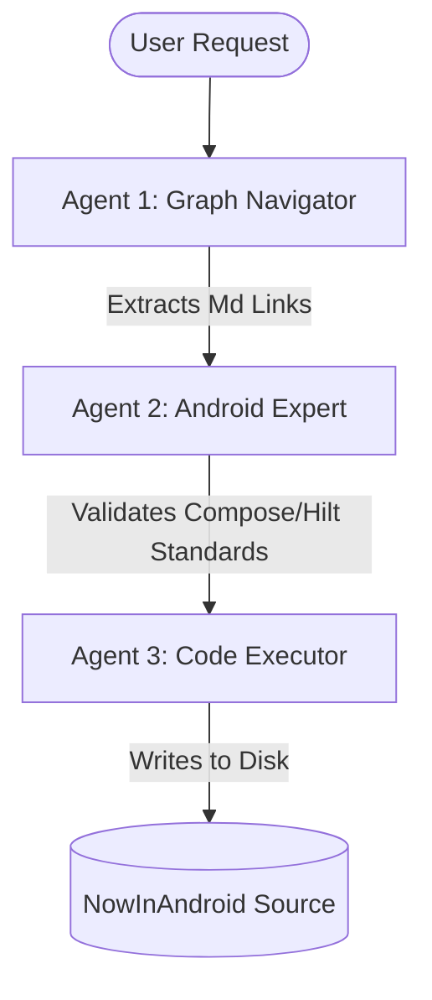

# 🗺️ Now In Android: Agentic Knowledge Graph MOC 

## 📌 Project Overview 

This file serves as the master Map of Content (MOC) linking Google's **Now in Android** (NIA) codebase architecture to an AI Agent team (Google Antigravity, OpenClaw, or LangGraph). 

By utilizing an ** Obsidian Knowledge Graph + RAG (GraphRAG)** approach, local AI agents can navigate systemic dependencies, architectural boundaries, and Jetpack Compose patterns without breaking code context into fragmented text chunks. 

--- 

## 🛠️ Architecture & RAG Alignment 

### 1. Retrieval 

- **Source:** Local `.md` files mapping out modules, Hilt injections, and UI components. 
- **Mechanism:** Agent traverses the Obsidian internal links (`[[Node]]`) to track architectural dependencies. 

### 2. Augmentation 

- **Injected Context:** Structural relationships (e.g., `MainActivity` ➡️ `MainViewModel` ➡️ `UserDataRepository`). 
- **Advantage:** Prevents the LLM from hallucinating missing architectural layers or guessing dependency injection paths. 

### 3. Generation 

- **Output:** Accurate, idiomatic Android code following modern Google guidelines (Jetpack Compose, Hilt, Coroutines, Flow). 

--- 

## 🤖 Agent Framework Integrations 

### 🧱 Google Antigravity Configuration 

- **Context Control:** Native Model Context Protocol (MCP) server integration. 
- **Workspace Mapping:** Point Antigravity to the root folder housing both `/app` code and `/obsidian-vault`. 
- **System Prompt Rule:** 
 > _"Always parse corresponding markdown documentation nodes before performing localized code edits inside Android modules."_ 

### 🛸 OpenClaw Configuration 

- **Sandbox Location:** Mount the Obsidian vault inside `~/.openclaw/workspace/`. 
- **Loop Triggers:** Use markdown file tags (e.g., `#agent-task/refactor`) to prompt OpenClaw execution loops via local files. 

### 🕸️ LangGraph Custom Multi-Agent Blueprint 

--- 

## 📂 Vault Structure Map 

- **Modules Index:** [[architecture-modules]] 
- **Data Layer Flow:** [[core-data-layer]] 
- **Dependency Injection Graph:** [[di-hilt-modules]] 
- **Feature Modules:** 
 - [[feature-foryou]] 
 - [[feature-bookmarks]] 
 - [[feature-interests]] 

--- 

## 📋 Immediate Action Items 

- [ ] Run localized parsing script to generate initial `.md` notes from NIA codebase. 
- [ ] Connect Obsidian vault directory to the **Google Antigravity / OpenClaw** agent sandbox path. 
- [ ] Implement an MCP Markdown/Graph parser server. 
- [ ] Execute a test prompt: _"Explain how the :core:data repository updates UI state in :feature:foryou."_ 

--- 

#tags/rag #tags/graph-rag #tags/android #tags/antigravity #tags/openclaw #tags/langgraph 